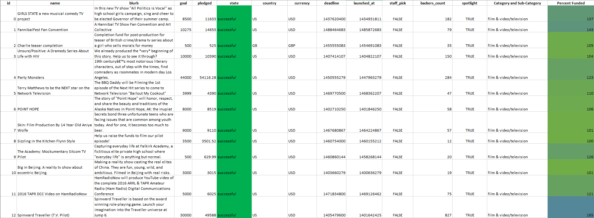
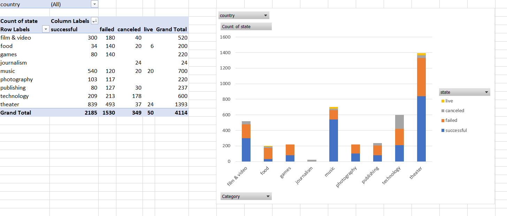
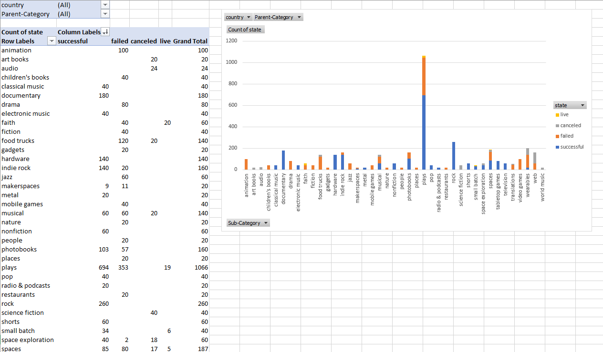
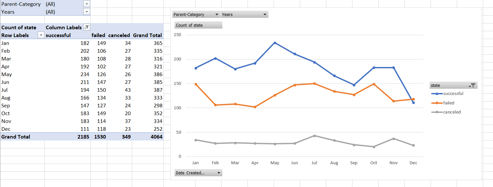
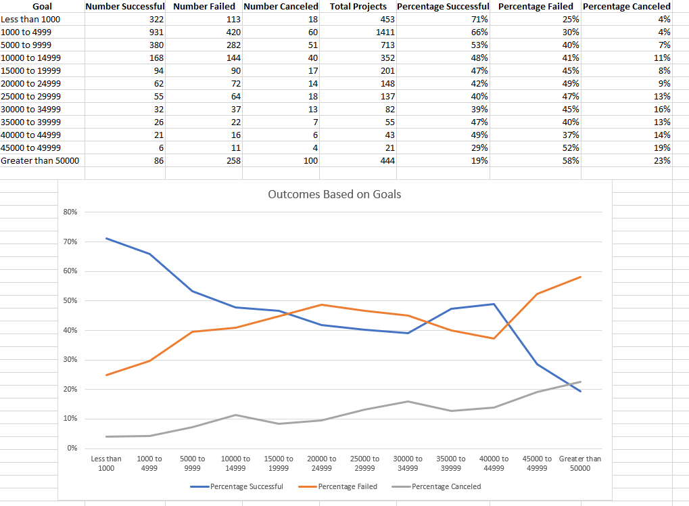

# Kickstarter Data

The premise of this project was to organize and analyse a database of four thousand past projects in order to uncover any hidden trends.  In order to achieve the goal of this project, I modified and analyzed data from an Excel using a series of complex formulas, conditional formatting, pivot tables, and pivot charts.

